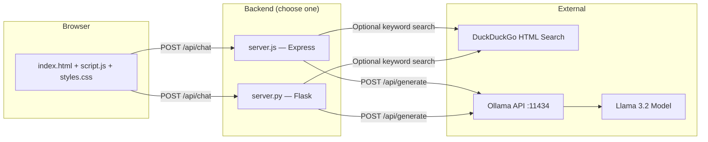

# Seven AI

**Seven AI** is a local-first chat application that runs entirely on your machine. It combines a modern web interface with [Ollama](https://ollama.com) and the **Llama 3.2** language model, plus optional live web search via DuckDuckGo — no API keys required for chat or search.

All inference happens locally through Ollama. Your conversations never leave your computer unless you enable web search for a query.

---

## Table of Contents

- [Features](#features)
- [Architecture](#architecture)
- [Tech Stack](#tech-stack)
- [Prerequisites](#prerequisites)
- [Installation](#installation)
- [Running the Application](#running-the-application)
- [Project Structure](#project-structure)
- [API Reference](#api-reference)
- [Configuration](#configuration)
- [User Interface Guide](#user-interface-guide)
- [Live Web Search](#live-web-search)
- [Ollama Integration](#ollama-integration)
- [Planned Features](#planned-features)
- [Troubleshooting](#troubleshooting)
- [License](#license)

---

## Features

### Core

- **Local AI chat** — Powered by Llama 3.2 through Ollama; no cloud LLM API keys needed
- **Live web search** — Keyword-triggered DuckDuckGo HTML scraping injects fresh context into prompts
- **Conversation management** — Create, switch between, and clear multiple chat sessions
- **Responsive UI** — Desktop sidebar layout with mobile-friendly slide-out navigation

### User Experience

- **Dark / light mode** — Theme preference persisted in `localStorage`
- **Typing indicator** — Animated dots while waiting for the model
- **Search badges** — AI replies show when a live web search was performed
- **Haptic feedback** — Optional vibration on supported mobile devices
- **Settings panel** — Appearance toggles, response length, and temperature controls (UI only for model params)

### Developer Experience

- **Dual backend options** — Node.js (Express) or Python (Flask) server with equivalent behavior
- **One-click launch scripts** — `start_seven_ai.sh` (macOS) and `start_seven_ai.bat` (Windows)
- **Static frontend** — Vanilla HTML, CSS, and JavaScript with no build step

---

## Architecture



### Request flow

1. User sends a message from the browser.
2. The frontend `POST`s to `/api/chat` with the message, conversation ID, and web search toggle state.
3. The backend checks whether the message matches search keywords and whether search is enabled.
4. If triggered, DuckDuckGo HTML results are scraped (2.5s timeout) and appended to the system prompt.
5. The backend calls Ollama's `/api/generate` endpoint with a structured system prompt and the user message.
6. The AI response is returned as JSON; the frontend renders it with optional search badge metadata.

---

## Tech Stack

| Layer | Technology |
|-------|------------|
| Frontend | HTML5, CSS3, Vanilla JavaScript |
| Fonts & icons | Google Fonts (Inter), Material Icons |
| Node backend | Express 4, node-fetch 2, cors, body-parser |
| Python backend | Flask, requests |
| AI runtime | Ollama + Llama 3.2 |
| Web search | DuckDuckGo HTML (keyless scraping) |
| Default port | `3000` |

---

## Prerequisites

Before running Seven AI, ensure the following are installed:

| Requirement | Purpose | Install |
|-------------|---------|---------|
| **Node.js** (v14+) | Run `server.js` via npm | [nodejs.org](https://nodejs.org) |
| **Python 3** (optional) | Run `server.py` via Flask | [python.org](https://python.org) |
| **Ollama** | Local LLM inference | [ollama.com/download](https://ollama.com/download) |
| **Llama 3.2 model** | AI backend | See [Ollama Integration](#ollama-integration) |

You only need **one** backend runtime (Node.js **or** Python), but **Ollama is required** for chat to work.

---

## Installation

### 1. Clone or download the project

```bash
cd "/path/to/Original Copy Seven"
```

### 2. Install Node.js dependencies

```bash
npm install
```

This installs:

- `express` — HTTP server and static file hosting
- `node-fetch` — HTTP client for Ollama and DuckDuckGo
- `cors` — Cross-origin resource sharing
- `body-parser` — JSON request parsing
- `nodemon` (dev) — Auto-restart during development

### 3. Install Python dependencies (optional)

If you prefer the Flask backend:

```bash
python3 -m venv .venv
source .venv/bin/activate   # macOS/Linux
# .venv\Scripts\activate    # Windows

pip install flask requests
```

### 4. Install Ollama and pull the model

```bash
# Install Ollama from https://ollama.com/download, then:
ollama pull llama3.2
```

> **Note:** The Node server requests `llama3.2:latest`; the Python server requests `llama3.2`. Ollama resolves these flexibly, but if chat fails with a model-not-found error, run `ollama list` and align the model name in `server.js` or `server.py` with your installed tag.

---

## Running the Application

### Quick start (macOS) — recommended

The shell script starts Ollama, the Flask server, and opens your browser:

```bash
chmod +x start_seven_ai.sh
./start_seven_ai.sh
```

This script:

1. Verifies Python 3 is installed
2. Opens a new Terminal window running `ollama run llama3.2`
3. Starts `server.py` in debug mode using the project `.venv`
4. Opens `http://localhost:3000` in your default browser

### Quick start (Windows)

```cmd
start_seven_ai.bat
```

This script:

1. Installs `flask` and `requests` if missing
2. Verifies Ollama is available
3. Starts Ollama with `llama3.2:1b` in a new cmd window
4. Starts `server.py` in another window
5. Opens the app in your browser

### Manual start — Node.js backend

**Terminal 1 — Ollama:**

```bash
ollama serve          # if not already running
ollama run llama3.2   # or ensure model is loaded
```

**Terminal 2 — Web server:**

```bash
npm start
# Server running on http://localhost:3000
```

**Development mode (auto-reload):**

```bash
npm run dev
```

### Manual start — Python backend

**Terminal 1 — Ollama:** (same as above)

**Terminal 2 — Flask server:**

```bash
source .venv/bin/activate   # if using venv
python server.py
```

The server binds to `0.0.0.0:3000` with Flask debug mode enabled.

### Environment variables

| Variable | Default | Description |
|----------|---------|-------------|
| `PORT` | `3000` | HTTP port (Node.js only; Python uses hardcoded `3000`) |
| `FLASK_ENV` | — | Set to `development` by the macOS launch script |
| `FLASK_DEBUG` | — | Set to `1` by the macOS launch script |

---

## Project Structure

```
Original Copy Seven/
├── index.html           # Main application shell and modals
├── script.js            # Frontend logic: chat, conversations, settings, uploads
├── styles.css           # Dark/light theme, layout, animations, responsive design
├── server.js            # Express backend — serves static files + /api/chat
├── server.py            # Flask backend — equivalent Python implementation
├── package.json         # Node.js metadata and npm scripts
├── package-lock.json    # Locked Node dependency versions
├── start_seven_ai.sh    # macOS one-click launcher (Python + Ollama)
├── start_seven_ai.bat   # Windows one-click launcher (Python + Ollama)
├── read.md              # Minimal run note for macOS shell script
├── .gitignore           # Ignores node_modules, .venv, logs
└── README.md            # This file
```

---

## API Reference

### `GET /`

Serves `index.html` — the main chat application.

### Static assets

| Backend | Route |
|---------|-------|
| Express | `express.static()` serves all files from project root |
| Flask | `/<path:path>` serves CSS, JS, and other static files |

### `POST /api/chat`

Send a user message and receive an AI response.

**Request body:**

```json
{
  "message": "Who is the Chief Minister of Karnataka?",
  "conversationId": "abc123xyz",
  "enableSearch": true
}
```

| Field | Type | Required | Description |
|-------|------|----------|-------------|
| `message` | string | Yes | User's chat message |
| `conversationId` | string | No | Client-side conversation identifier (logged server-side) |
| `enableSearch` | boolean | No | When `false`, disables live web search regardless of keywords |

**Success response (`200`):**

```json
{
  "response": "The Chief Minister of Karnataka is Siddaramaiah.",
  "conversationId": "abc123xyz",
  "searchPerformed": true,
  "searchQuery": "Who is the Chief Minister of Karnataka?"
}
```

| Field | Type | Description |
|-------|------|-------------|
| `response` | string | Llama 3.2 generated text |
| `conversationId` | string | Echo of the request conversation ID |
| `searchPerformed` | boolean | Whether DuckDuckGo search ran and returned results |
| `searchQuery` | string \| null | Original query if search ran; otherwise `null` |

**Error response (`500`):**

```json
{
  "error": "Failed to process your request",
  "details": "Ollama API error: 404"
}
```

---

## Configuration

### Model name

Update the Ollama model identifier in your chosen server file:

**Node.js** (`server.js`):

```javascript
model: 'llama3.2:latest',
```

**Python** (`server.py`):

```python
'model': 'llama3.2',
```

Run `ollama list` to see your exact model tag.

### System prompt

Both backends inject a system prompt that:

- Identifies the assistant as **Seven AI**
- Includes today's date
- Instructs direct, concise answers without refusal disclaimers
- Embeds baseline facts (e.g., Indian government officials)
- Appends live search context when available

Edit the `systemPrompt` / `system_prompt` block in `server.js` or `server.py` to customize behavior.

### Search keywords

Web search triggers when `enableSearch !== false` and the message contains any keyword from:

```
current, latest, today, now, who is, what is, cm of, chief minister,
prime minister, president, governor, minister, education minister, news,
weather, score, 2024, 2025, 2026, update, recent, who, karnataka, india
```

Modify the `searchKeywords` / `keywords` array in either server file to tune triggering behavior.

### Search timeout

Both backends use a **2.5 second** timeout for DuckDuckGo requests. If search fails or times out, the app continues in offline mode using the model's built-in knowledge and system prompt facts.

---

## User Interface Guide

### Side panel

| Control | Action |
|---------|--------|
| **New conversation** | Creates a fresh chat session |
| **Conversation list** | Click to switch between sessions; titles auto-update from the first message |
| **Settings** | Opens appearance and model preference modal |

### Chat area

| Control | Action |
|---------|--------|
| **Menu (☰)** | Toggle side panel on mobile/tablet |
| **Refresh** | Clear current conversation messages |
| **Attach (📎)** | Open file upload modal (UI only — see [Planned Features](#planned-features)) |
| **Globe (🌐)** | Toggle live web search on/off (highlighted when active) |
| **Mic** | Placeholder — shows "coming soon" alert |
| **Send** | Submit message (also **Enter** key) |

### Settings modal

| Setting | Storage | Backend effect |
|---------|---------|----------------|
| Dark Mode | `localStorage` (`darkMode`) | UI only |
| Haptic Feedback | In-memory | UI only |
| Response Length | In-memory | **Not sent to backend** |
| Temperature | In-memory | **Not sent to backend** |

> **Note:** Response length and temperature controls are present in the UI but are not yet wired to the Ollama API. To change model temperature, extend the `/api/chat` handler to pass Ollama's `options.temperature` parameter.

### Theme

Dark mode is the default. Light mode adds the `light-mode` class to `<body>` and swaps CSS custom properties defined in `:root`.

---

## Live Web Search

Seven AI performs **keyless** web search by scraping DuckDuckGo's HTML results page:

1. No search API key is required.
2. Up to **5 snippets** are extracted per query.
3. Snippets are cleaned (HTML stripped, entities decoded) and injected into the system prompt.
4. The frontend displays a badge: *"Searched web for …"* when search was used.

### When search runs

Search runs only when **both** conditions are met:

- The globe toggle is **enabled** (`enableSearch: true`)
- The message matches at least one keyword in the trigger list

### Offline fallback

If DuckDuckGo is unreachable or the request times out, the server logs:

```
Web search unavailable or timed out (operating in offline mode)
```

Chat continues using the local model and embedded baseline facts in the system prompt.

---

## Ollama Integration

Seven AI communicates with Ollama's REST API:

```
POST http://localhost:11434/api/generate
```

**Payload:**

```json
{
  "model": "llama3.2:latest",
  "system": "<system instructions + optional search context>",
  "prompt": "<user message>",
  "stream": false
}
```

### Verify Ollama is running

```bash
curl http://localhost:11434/api/tags
```

### Pull the model

```bash
ollama pull llama3.2
# or the smaller variant referenced in launch scripts:
ollama pull llama3.2:1b
```

### Start Ollama manually

```bash
ollama serve    # background service
ollama run llama3.2
```

---

## Planned Features

The following UI elements exist but are **not fully implemented**:

| Feature | Status |
|---------|--------|
| Voice input | Alert placeholder only |
| File upload processing | Modal UI only; files are not sent to the backend |
| Response length setting | UI only; not passed to Ollama |
| Temperature setting | UI only; not passed to Ollama |
| Conversation persistence | In-memory only; lost on page refresh |
| Streaming responses | Ollama streaming disabled (`stream: false`) |

---

## Troubleshooting

### "I'm having trouble connecting to my brain right now"

The frontend shows this when `/api/chat` fails. Common causes:

1. **Ollama not running** — Start with `ollama serve` and verify `curl http://localhost:11434/api/tags`
2. **Model not installed** — Run `ollama pull llama3.2` and check `ollama list`
3. **Model name mismatch** — Align the `model` field in `server.js` / `server.py` with your installed tag
4. **Backend not running** — Ensure `npm start` or `python server.py` is active on port 3000

### Port 3000 already in use

```bash
# macOS/Linux — find and stop the process
lsof -i :3000
kill <PID>

# Or use a different port (Node.js)
PORT=3001 npm start
```

### Web search never triggers

- Confirm the **globe icon** is active (highlighted blue)
- Include a trigger keyword in your message (e.g., "latest", "who is", "today")
- Check network connectivity to `html.duckduckgo.com`

### macOS launch script fails

- Ensure Python 3 is installed: `python3 --version`
- Ensure `.venv` exists or create it: `python3 -m venv .venv && pip install flask requests`
- Update the hardcoded `PYTHON_PATH` in `start_seven_ai.sh` if your venv location differs

### Windows launch script fails

- Install Ollama and add it to PATH
- Run `pip install flask requests` manually if auto-install fails
- Ensure Python is available as `python` in cmd

### Chat works but responses seem outdated

- Enable web search and use keyword-rich queries for current events
- Remember: without search, the model relies on its training data and hardcoded baseline facts in the system prompt

---

## License

ISC (as specified in `package.json`).

---

## Quick Reference

```bash
# Install
npm install
ollama pull llama3.2

# Run (Node.js)
ollama serve &
npm start
open http://localhost:3000

# Run (Python)
ollama serve &
python server.py
open http://localhost:3000

# Run (macOS script)
./start_seven_ai.sh
```

**Seven AI • Make your own AI**
